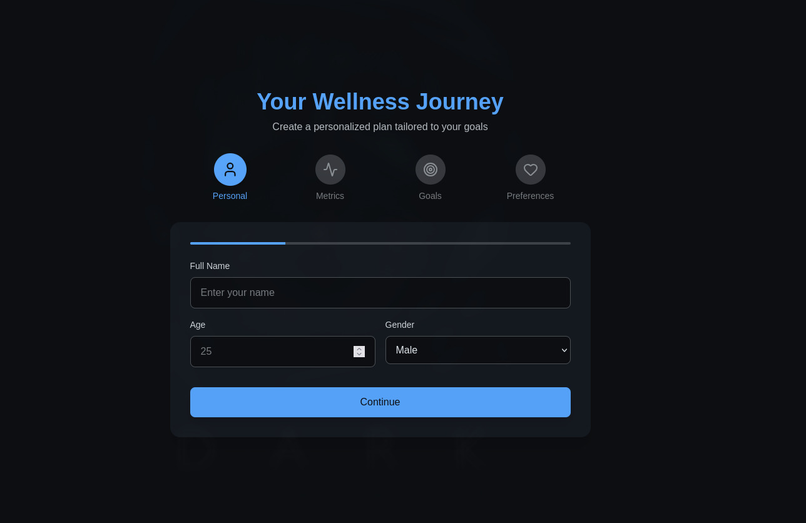
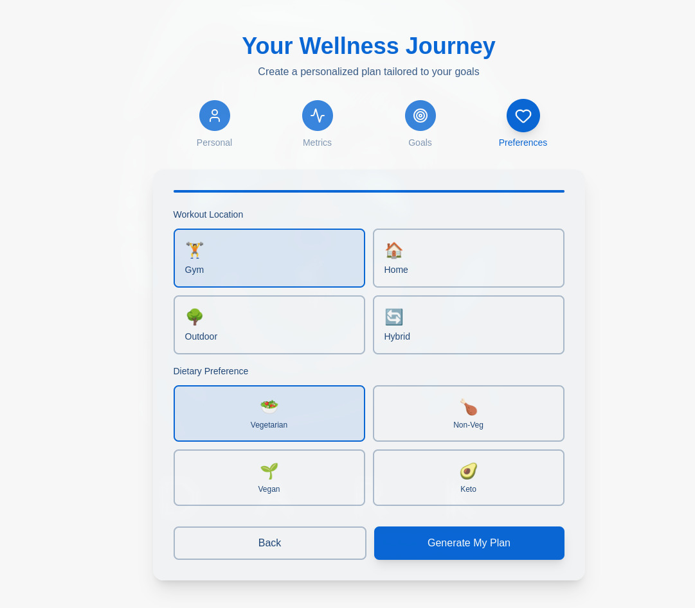
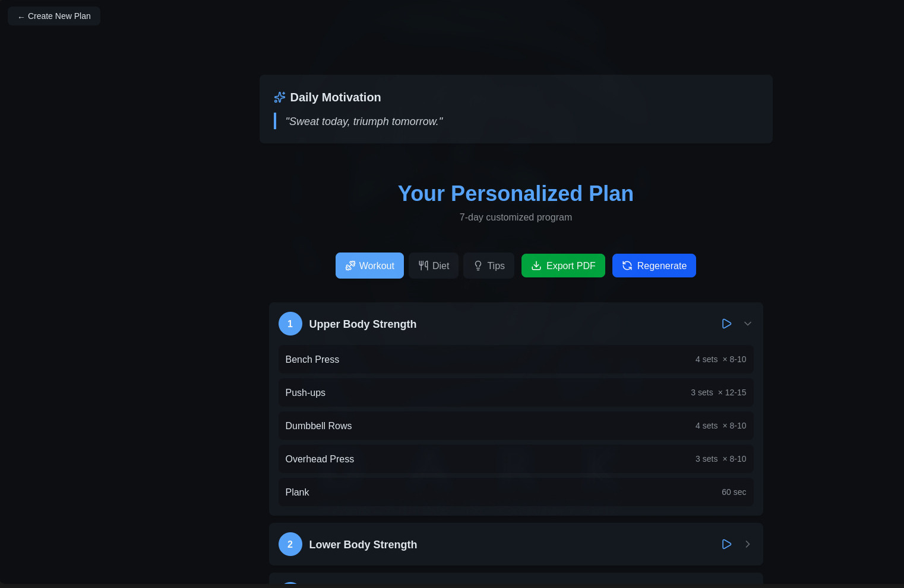
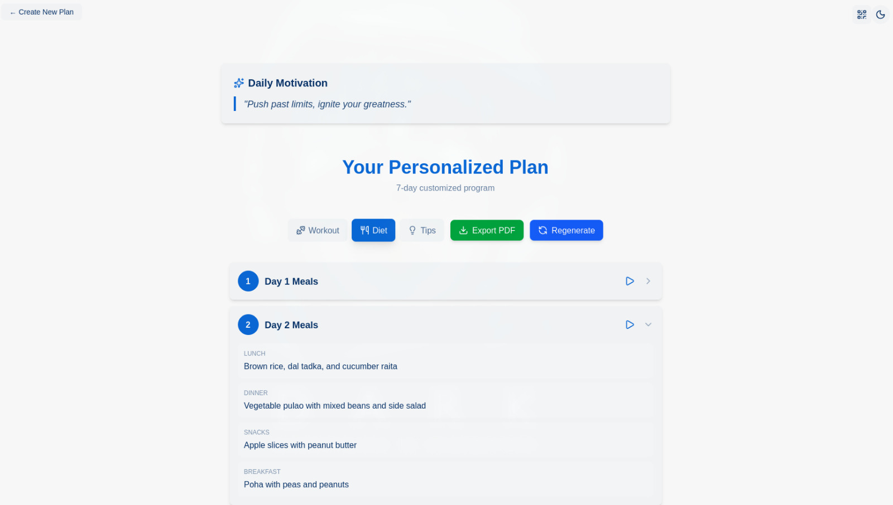
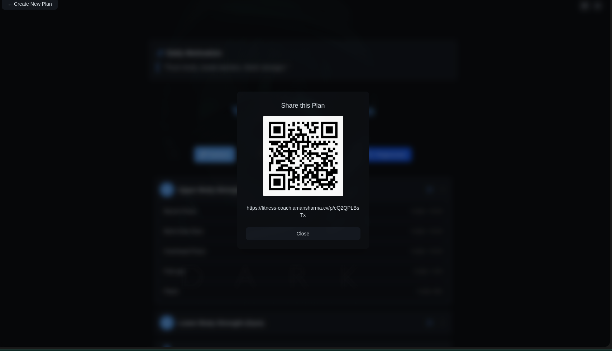

# AI Fitness Coach

🔗 **Live Demo:** [https://fitness-coach.amansharma.cv/](https://fitness-coach.amansharma.cv/)

A Next.js application that generates personalized 7-day workout and diet plans using AI. Users fill out a multi-step form, and the app leverages Groq for plan generation and text-to-speech, Freepik for on-demand image generation, and Supabase for storing and sharing plans.

## 📸 Screenshots

<table>
  <tr>
    <td><Strong>Form Step-1</Strong></td>
    <td><Strong>Form Step-4</Strong></td>
  </tr>
  <tr>
    <td></td>
    <td></td>
  </tr>
  <tr>
    <td><Strong>Workout Plan</Strong></td>
    <td><Strong>Diet Plan</Strong></td>
  </tr>
  <tr>
    <td></td>
    <td></td>
  </tr>
  <tr>
    <td><Strong>QR Code Sharing Modal</Strong></td>
    <td><Strong>AI-Generated Exercise Image</Strong></td>
  </tr>
  <tr>
    <td></td>
    <td></td>
  </tr>
</table>

## ✨ Features

- **Multi-Step User Profile Form**: Collects detailed user information including personal data, physical metrics, fitness goals, and dietary preferences.
- **AI Plan Generation**: Uses the Groq API to generate a complete 7-day workout and diet plan tailored to the user's profile.
- **Database Storage**: Saves generated plans to a Supabase database, providing a unique, shareable URL for each plan.
- **Dynamic Plan Display**: A clean, tabbed interface to view the Workout, Diet, and Lifestyle Tips for each day.
- **AI Image Generation**: Dynamically fetches AI-generated images for exercises and food items from the Freepik API on user click.
- **Text-to-Speech**: Uses Groq's PlayAI model to generate audio readouts for daily plans and tips.
- **Daily Motivation**: Fetches a new motivational quote from an API for the plan page.
- **QR Code Sharing**: Instantly generate a QR code to share the plan's URL.
- **Theme Toggle**: Supports both light and dark modes, saving the user's preference in local storage.
- **Export to PDF**: A "Export PDF" button that uses the browser's print functionality to save the plan.
- **PWA Enabled**: Configured as a Progressive Web App for an installable, app-like experience.

## 🛠️ Tech Stack

- **Framework**: Next.js
- **Language**: TypeScript
- **Database**: Supabase (PostgreSQL)
- **AI (LLM & Audio)**: Groq
- **AI (Image Generation)**: Freepik AI
- **Styling**: Tailwind CSS
- **UI**: React, Lucide React (Icons)
- **Schema Validation**: Zod
- **PWA**: @ducanh2912/next-pwa

## 🚀 Getting Started

### 1. Prerequisites

- Node.js (v20.9.0 or later recommended)
- npm, yarn, or pnpm

### 2. Installation

Clone the repository:

```bash
git clone https://github.com/gsamansharma/ai-fitness-coach.git
cd ai-fitness-coach
```

Install dependencies:

```bash
npm install
```

### 3. Environment Variables

Create a `.env.local` file in the root of the project and add the following environment variables. You can get these keys from your Supabase, Groq, and Freepik dashboards.

```env
NEXT_PUBLIC_SUPABASE_URL=YOUR_SUPABASE_URL
NEXT_PUBLIC_SUPABASE_ANON_KEY=YOUR_SUPABASE_ANON_KEY
SUPABASE_SERVICE_KEY=YOUR_SUPABASE_SERVICE_KEY
GROQ_API_KEY=YOUR_GROQ_API_KEY
FREEPIK_API_KEY=YOUR_FREEPIK_API_KEY
```

- `NEXT_PUBLIC_SUPABASE_URL` & `NEXT_PUBLIC_SUPABASE_ANON_KEY` are used for client-side Supabase access.
- `SUPABASE_SERVICE_KEY` is used for server-side access to write to the database.
- `GROQ_API_KEY` is used for plan generation, quotes, and text-to-speech.
- `FREEPIK_API_KEY` is used for image generation.

### 4. Run the Development Server

Run the development server (with Webpack, as specified in package.json):

```bash
npm run dev
```

Open [http://localhost:3000](http://localhost:3000) with your browser to see the result.

## 📜 Available Scripts

- `npm run dev`: Starts the development server with Webpack.
- `npm run build`: Builds the application for production.
- `npm run start`: Starts a production server.
- `npm run lint`: Runs the ESLint linter.

## 🔌 API Endpoints

- `/api/generate-plan`: (POST) Receives UserProfileData JSON. Generates a 7-day plan via Groq, saves it to Supabase, and returns a unique planId.
- `/api/generate-image`: (POST) Receives a prompt string. Generates an image using the Freepik API and returns a Base64-encoded image URL.
- `/api/generate-voice`: (POST) Receives a text string. Streams back a .wav audio file from Groq's text-to-speech API.
- `/api/get-quote`: (GET) Fetches a random motivational fitness quote from the Groq API.

## 👤 Author

**Aman Sharma**

- Portfolio: [amansharma.cv](https://amansharma.cv)
- GitHub: [@gsamansharma](https://github.com/gsamansharma)
- LinkedIn: [@gsamansharma](https://linkedin.com/in/gsamansharma)

---

⭐ Star this repo if you find it useful!